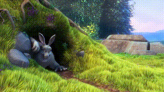
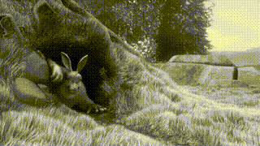
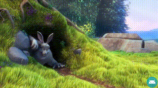

# Mp4Composer-android
[](http://developer.android.com/index.html)

[](https://android-arsenal.com/api?level=21)

This library generate an Mp4 movie using Android MediaCodec API and apply filter, scale, trim, transcode, crop, mute and rotate Mp4.<br>
Idea from: [android-transcoder](https://github.com/ypresto/android-transcoder)

<table>
    <td><br>Sample Video<br>No filter</td>
    <td><br><a href="mp4compose/src/main/java/com/daasuu/mp4compose/filter/GlGrayScaleFilter.java">GlGlayScaleFilter</a><br> apply</td>
    <td><br><a href="mp4compose/src/main/java/com/daasuu/mp4compose/filter/GlMonochromeFilter.java">GlMonochromeFilter</a><br> apply</td>
    <td><br><a href="mp4compose/src/main/java/com/daasuu/mp4compose/filter/GlWatermarkFilter.java">GlWatermarkFilter</a><br> apply</td>
</table>


## Gradle
Step 1. Add the JitPack repository to your build file
```groovy
allprojects {
	repositories {
		...
		maven { url 'https://jitpack.io' }
	}
}
```
Step 2. Add the dependency
```groovy
dependencies {
        implementation 'com.github.MasayukiSuda:Mp4Composer-android:v0.4.1'
}
```

## Usage
```
    new Mp4Composer(srcMp4Path, destMp4Path)
            .rotation(Rotation.ROTATION_90)
            .size((width) 540, (height) 960)
            .fillMode(FillMode.PRESERVE_ASPECT_FIT)
            .filter(new GlFilterGroup(new GlMonochromeFilter(), new GlVignetteFilter()))
            .trim((trimStartMs) 200, (trimEndMs) 5000)
            .listener(new Mp4Composer.Listener() {
                @Override
                public void onProgress(double progress) {
                    Log.d(TAG, "onProgress = " + progress);
                }

                @Override
                public void onCompleted() {
                    Log.d(TAG, "onCompleted()");
                    runOnUiThread(() -> {
                        Toast.makeText(context, "codec complete path =" + destPath, Toast.LENGTH_SHORT).show();
                    });
                }

                @Override
                public void onCanceled() {
                    Log.d(TAG, "onCanceled");
                }

                @Override
                public void onFailed(Exception exception) {
                    Log.e(TAG, "onFailed()", exception);
                }
            })
            .start();
```
## Builder Method
| method | description |
|:---|:---|
| rotation | Rotation of the movie, default Rotation.NORMAL |
| size | Resolution of the movie, default same resolution of src movie. If you specify a resolution that MediaCodec does not support, an error will occur. |
| fillMode | Options for scaling the bounds of an movie. PRESERVE_ASPECT_FIT is fit center. PRESERVE_ASPECT_CROP is center crop , default PRESERVE_ASPECT_FIT. <br>FILLMODE_CUSTOM is used to crop a video. Check <a href="https://github.com/MasayukiSuda/Mp4Composer-android/blob/master/art/fillmode_custom.gif">this</a> for behavior. Sample source code is <a href="https://github.com/MasayukiSuda/Mp4Composer-android/blob/master/sample/src/main/java/com/daasuu/sample/FillModeCustomActivity.java">this</a>. |
| filter | This filter is OpenGL Shaders to apply effects on video. Custom filters can be created by inheriting <a href="https://github.com/MasayukiSuda/Mp4Composer-android/blob/master/mp4compose/src/main/java/com/daasuu/mp4compose/filter/GlFilter.java">GlFilter.java</a>. , default GlFilter(No filter). Filters is <a href="https://github.com/MasayukiSuda/Mp4Composer-android/tree/master/mp4compose/src/main/java/com/daasuu/mp4compose/filter">here</a>. |
| videoBitrate | Set Video Bitrate, default video bitrate is 0.25 * 30 * outputWidth * outputHeight |
| mute | Mute audio track on exported video. Default `mute = false`. |
| trim | Trim both audio and video tracks to the provided start and end times, inclusive. Default does not trim anything from the start or end. |
| flipVertical | Flip Vertical on exported video. Default `flipVertical = false`. |
| flipHorizontal | Flip Horizontal on exported video. Default `flipHorizontal = false`. |
| videoFormatMimeType | The mime type of the video format on exported video. default AUTO. Suppurt HEVC, AVC, MPEG4, H263. Check <a href="https://github.com/MasayukiSuda/Mp4Composer-android/blob/master/mp4compose/src/main/java/com/daasuu/mp4compose/VideoFormatMimeType.java" >this</a>. |
| timeScale | Set TimeScale. default value is 1f. should be in range 0.125 (-8X) to 8.0 (8X) |


## References And Special Thanks to
* [android-transcoder](https://github.com/ypresto/android-transcoder)
* [android-transcoder Japanese blog](http://qiita.com/yuya_presto/items/d48e29c89109b746d000)
* [android-gpuimage](https://github.com/CyberAgent/android-gpuimage)
* [Android MediaCodec stuff](http://bigflake.com/mediacodec/)
* [grafika](https://github.com/google/grafika)
* [libstagefright](https://android.googlesource.com/platform/frameworks/av/+/lollipop-release/media/libstagefright)


## Sample Dependencies
* [glide](https://github.com/bumptech/glide)
* [ExoPlayer](https://github.com/google/ExoPlayer)


## License

[MIT License](https://github.com/MasayukiSuda/Mp4Composer-android/blob/master/LICENSE)
